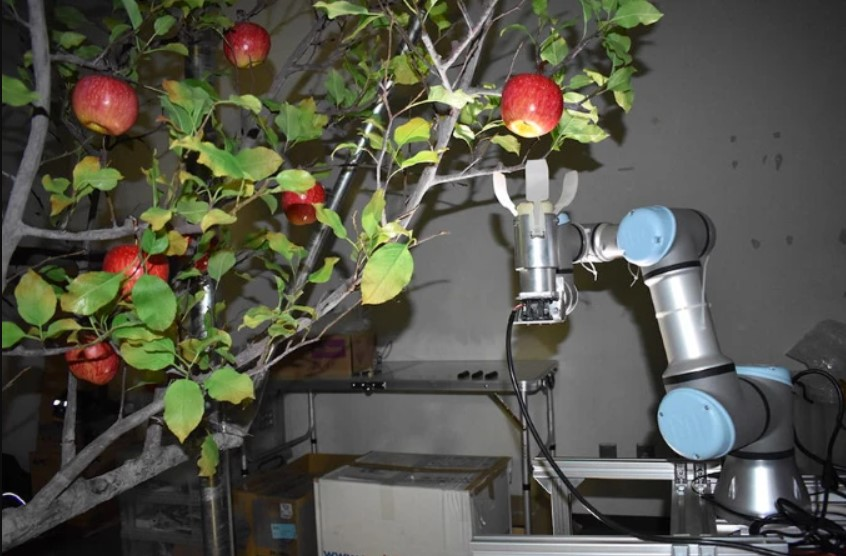

# Harvest-Hackers
We are a team from LDCE creating UAV solutions for precision agriculture
Here’s a README file for "Harvest Hackers" that outlines the project’s purpose, components, and features:

---

# Harvest Hackers

**Harvest Hackers** is a project focused on revolutionizing apple orchard management in Himachal Pradesh. By developing specialized drone attachments and an integrated digital platform, we aim to empower farmers with real-time insights and actionable data to enhance crop health, productivity, and sustainability.
.webp)
## Project Overview

Harvest Hackers introduces **Orchard Sense**—an innovative drone-based solution with two key attachments for monitoring, analysis, and precise actions in apple orchards:

1. **MIDS (Multispectral Imaging Drone System)**: A computer vision system equipped with IR and NDVI sensors for:
   - Yield estimation
   - Production health monitoring
   - Disease detection through HD multispectral footage

2. **RPAS (Robotic Pesticide Application System)**: A robotic spraying system that ensures:
   - Targeted pesticide application to minimize use
   - Autonomous navigation with GPS
   - Real-time monitoring and data collection for pest management

These attachments work with a **dashboard** accessible via both a **Web App and Mobile App** to give farmers real-time data insights, including yield forecasts, pesticide needs, and tree health assessments.

## Key Features

### End-to-End System
Orchard Sense combines state-of-the-art hardware and software for comprehensive orchard management, including:

1. **Multispectral and Thermal Cameras**: Enable tree health assessment and farm mapping.
   
2. **Advanced Sensors**: 
   - **IR and NDVI** for tree health and apple quality analysis
   - **LiDAR** and **Vis/NIR** sensors for precise yield estimation

3. **Data Processing with Edge Computing**: 
   - Utilizes **Raspberry Pi 5** for onboard computing to optimize image capture and analysis.

4. **Data Integration via LoRa Wi-Fi**: 
   - Facilitates virtual mapping and actionable recommendations for farmers.

5. **Compatibility with Various Drones**: 
   - Custom-fit through 3D printing to work with different drone models and integrate with farm management software.

6. **AI & Machine Learning Models**:
   - CNN, SSD (Single Shot MultiBox Detector), and ORB (Oriented FAST and Rotated BRIEF) for predicting disease, pest outbreaks, and yield estimations.

7. **Precision Spraying System**: 
   - Robotic attachment for accurate fertilizer and pesticide application.

8. **Insurance Claims Support**:
   - Drone footage and blockchain-backed traceability for efficient disaster claim processing.

## System Components and Workflow

1. **Digitizing the Farm**: Uses multispectral imaging and precise sensors for data capture.
2. **Image Processing**: Captures Agri Indices footage for in-depth analysis.
3. **Apple Detection and Classification**: Segmentation and classification through AI for health and yield assessment.
4. **Edge Computing**: Efficient onboard and ground processing delivers fast, actionable insights.

## Dashboard Features

The Harvest Hackers dashboard is designed for farmer ease, offering:
- **Real-time field data** with visual mapping
- **Simple reports** and intuitive UI for quick decision-making
- **Tree Health Insights**: Chlorophyll and moisture level tracking for early stress detection
- **Yield and Quality Estimation**: Provides targeted recommendations for optimal harvesting and nutrient management.

## Future Vision

Harvest Hackers envisions a sustainable, tech-driven future for orchard management, where farmers have real-time access to critical data, enabling better crop health and productivity. With defined drone routines and intelligent flight modes, Orchard Sense ensures continuous assessment, early detection of issues, and actionable insights.

## Contact and Contribution

Interested in contributing or learning more? Please feel free to reach out or raise issues directly on this repository.

---

Let me know if you'd like to add more details or have specific requirements for this README!
